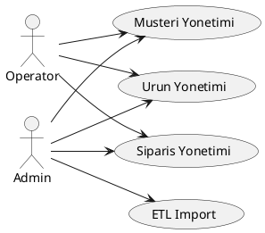
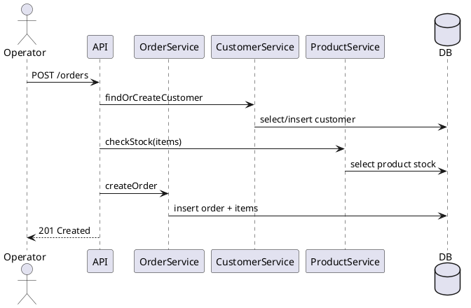
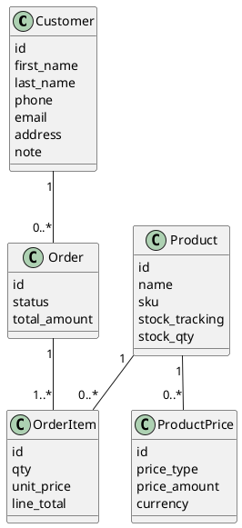

# Mimari Tasarim Dokumani (Taslak)

## 1) Genel Mimari

MiniCRM tek servisli bir API uygulamasidir. Uc ana domain vardir: Musteri, Urun/Stok, Siparis.
API uzerinden CRUD, siparis akisi ve ETL islemleri saglanir.

## 2) Veritabani Semasi

Not: tipler ve indeksler, tipik bir SQL veritabani (PostgreSQL/MySQL) icin öneri olarak verilmistir.

### 2.1 Customers

- id (PK, UUID veya BIGINT)
- first_name (VARCHAR(100), NOT NULL)
- last_name (VARCHAR(100), NULL)
- phone (VARCHAR(20), NULL)
- email (VARCHAR(150), NULL)
- address (TEXT, NULL)
- note (TEXT, NULL)
- created_at (TIMESTAMP, NOT NULL)
- updated_at (TIMESTAMP, NOT NULL)

Indeks onerisi:

- uniq_phone (phone, NULL disi)
- uniq_email (email, NULL disi)
- name_index (first_name, last_name)

Kisitlar:

- phone ve email ikisinden en az biri dolu olmali (CHECK).

### 2.2 Products

- id (PK, UUID veya BIGINT)
- name (VARCHAR(150), NOT NULL)
- sku (VARCHAR(50), UNIQUE, NOT NULL)
- stock_tracking (BOOLEAN, NOT NULL)
- stock_qty (INTEGER, NULL olabilir, stock_tracking=false ise)
- created_at (TIMESTAMP, NOT NULL)
- updated_at (TIMESTAMP, NOT NULL)

### 2.3 ProductPrices (opsiyonel)

- id (PK, UUID veya BIGINT)
- product_id (FK -> Products, NOT NULL)
- price_type (ENUM: retail, wholesale, promo)
- price_amount (DECIMAL(10,2), NOT NULL)
- currency (CHAR(3), NOT NULL)
- created_at (TIMESTAMP, NOT NULL)
- updated_at (TIMESTAMP, NOT NULL)

### 2.4 Orders

- id (PK, UUID veya BIGINT)
- customer_id (FK -> Customers, NULL olabilir - misafir siparis)
- status (ENUM: draft, pending, preparing, shipped, delivered, cancelled)
- total_amount (DECIMAL(10,2), NOT NULL)
- created_at (TIMESTAMP, NOT NULL)
- updated_at (TIMESTAMP, NOT NULL)

### 2.5 OrderItems

- id (PK, UUID veya BIGINT)
- order_id (FK -> Orders, NOT NULL)
- product_id (FK -> Products, NOT NULL)
- qty (INTEGER, NOT NULL)
- unit_price (DECIMAL(10,2), NOT NULL)
- line_total (DECIMAL(10,2), NOT NULL)

## 3) Moduller / Servisler

- CustomerService: CRUD, duplicate kontrolu, misafir kayit olusturma
- ProductService: CRUD, stok kontrolu, fiyat tipleri
- OrderService: siparis olusturma, stok dusumu, durum gecisleri
- ETLService: Excel/CSV import, temizleme, raporlama
- Logging: request/response, hata, trace id
- Config: ortam ayarlari, env, secret ayrimi

## 4) UML Diyagramlari (Metin + PlantUML Taslak)

### 4.1 Use Case (PlantUML taslak)



### 4.2 Sequence - Siparis Olusturma (PlantUML taslak)



### 4.3 Class (PlantUML taslak)



## 5) API Uc Listesi (Taslak)

Musteri:

- GET /customers
- GET /customers/:id
- POST /customers
- PUT /customers/:id
- DELETE /customers/:id

Urun:

- GET /products
- GET /products/:id
- POST /products
- PUT /products/:id
- DELETE /products/:id

Siparis:

- GET /orders
- GET /orders/:id
- POST /orders
- PATCH /orders/:id/status

ETL:

- POST /etl/customers/import

Genel:

- GET /health

### 5.1 Ornek Istek/Yanit

POST /customers

```json
{
  "first_name": "Ahmet",
  "last_name": "Yilmaz",
  "phone": "+905321112233",
  "email": "ahmet.yilmaz@mail.com",
  "address": "Istanbul, Kadikoy",
  "note": "VIP"
}
```

### 5.2 Hata Yanit Formati (Ornek)

Tüm hata yanitlari tek formatta doner.

```json
{
  "error": {
    "code": "VALIDATION_ERROR",
    "message": "phone or email required",
    "details": [
      { "field": "phone", "issue": "missing" },
      { "field": "email", "issue": "missing" }
    ],
    "trace_id": "trc_abc123"
  }
}
```

PUT /customers/:id

```json
{
  "address": "Ankara, Cankaya",
  "note": "Adres guncellendi"
}
```

```json
{
  "id": "cst_123",
  "address": "Ankara, Cankaya",
  "note": "Adres guncellendi",
  "updated_at": "2026-01-11T12:00:00Z"
}
```

DELETE /customers/:id

```json
{
  "status": "deleted"
}
```

Ornek hata kodlari:

- VALIDATION_ERROR
- NOT_FOUND
- CONFLICT
- INTERNAL_ERROR

POST /products

```json
{
  "name": "Kahve Makinesi",
  "sku": "KM-001",
  "stock_tracking": true,
  "stock_qty": 20
}
```

```json
{
  "id": "prd_001",
  "name": "Kahve Makinesi",
  "sku": "KM-001",
  "stock_tracking": true,
  "stock_qty": 20
}
```

PUT /products/:id

```json
{
  "price_type": "retail",
  "price_amount": 479.9,
  "currency": "TRY"
}
```

```json
{
  "id": "prd_001",
  "name": "Kahve Makinesi",
  "sku": "KM-001",
  "stock_tracking": true,
  "stock_qty": 20,
  "prices": [{ "price_type": "retail", "price_amount": 479.9, "currency": "TRY" }]
}
```

POST /orders

```json
{
  "customer": {
    "id": "cst_123"
  },
  "items": [
    {
      "product_id": "prd_001",
      "qty": 2,
      "unit_price": 499.9
    }
  ]
}
```

```json
{
  "id": "ord_1001",
  "status": "pending",
  "total_amount": 999.8,
  "items": [
    {
      "product_id": "prd_001",
      "qty": 2,
      "unit_price": 499.9,
      "line_total": 999.8
    }
  ]
}
```

PATCH /orders/:id/status

```json
{
  "status": "preparing"
}
```

```json
{
  "id": "ord_1001",
  "status": "preparing"
}
```

POST /etl/customers/import

```json
{
  "source": "customers.xlsx",
  "mapping": {
    "first_name": "Ad",
    "last_name": "Soyad",
    "phone": "Telefon",
    "email": "Email",
    "address": "Adres",
    "note": "Not"
  }
}
```

```json
{
  "imported": 120,
  "skipped": 7,
  "errors": 5,
  "report_id": "etl_20260111_01"
}
```

## 6) Logging, Config, Migration

### 6.1 Logging

- Request/response loglari
- Hata loglari
- Trace ID (header: X-Trace-Id, yoksa generate)
- Seviyeler: info, warn, error

Ornek log ciktilari (JSON):

```json
{
  "level": "info",
  "msg": "request completed",
  "method": "POST",
  "path": "/orders",
  "status": 201,
  "trace_id": "trc_abc123",
  "duration_ms": 42
}
```

```json
{
  "level": "error",
  "msg": "database error",
  "error": "duplicate key value violates unique constraint",
  "trace_id": "trc_def456"
}
```

### 6.2 Config

- .env ile ortama bagli ayarlar
- Gelistirme ve uretim ayrimi
- Secret ve sifreler repo disi tutulur

Onerilen config anahtarlari:

- NODE_ENV
- PORT
- DB_HOST
- DB_PORT
- DB_NAME
- DB_USER
- DB_PASSWORD
- LOG_LEVEL
- LOG_FORMAT (json/text)
- TRACE_ID_HEADER (varsayilan: X-Trace-Id)

### 6.3 Migration

- Versioned migration (timestamp dosya adi)
- Degisiklik raporu: yeni alanlar ve etkilenen tablolar

## 7) ERD (Metin Taslak)

- Customers 1..\* Orders (misafir sipariste customer_id NULL olabilir)
- Orders 1..\* OrderItems
- Products 1..\* OrderItems
- Products 0..\* ProductPrices

## 8) Siparis Durum Gecisleri (Oneri)

Asagidaki gecisler onayli kabul edilir:

- draft -> pending
- pending -> preparing
- preparing -> shipped
- shipped -> delivered
- pending -> cancelled
- preparing -> cancelled (stok veya musteri iptali)
